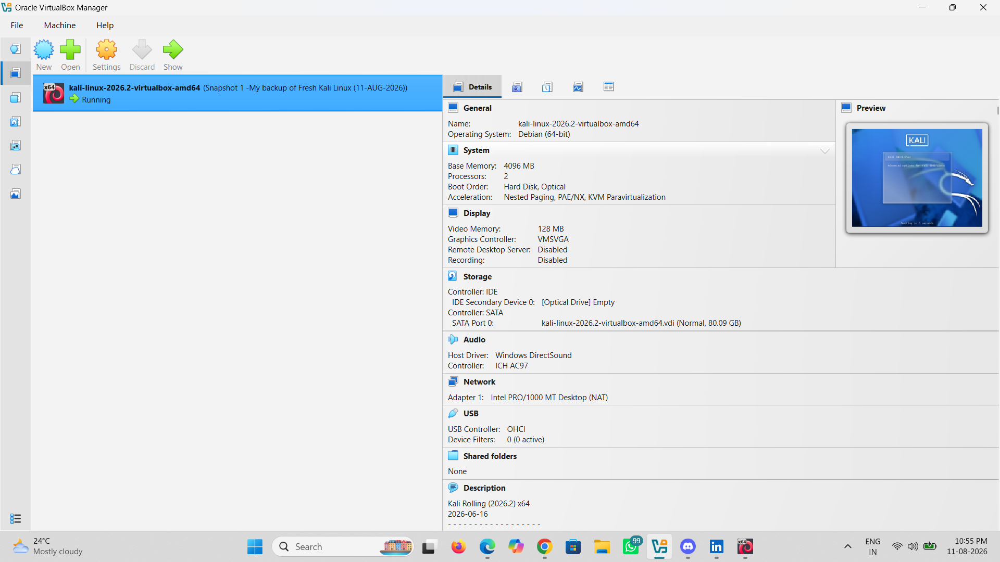
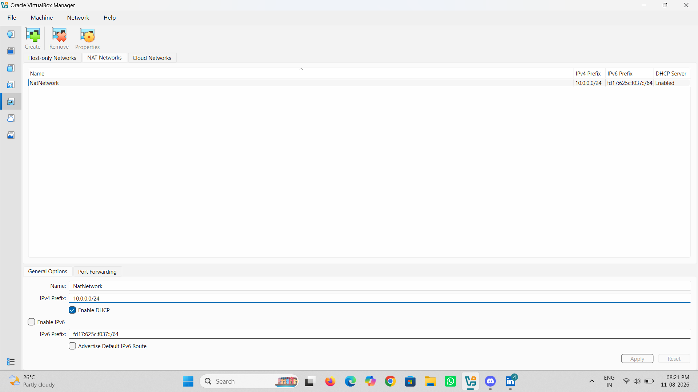
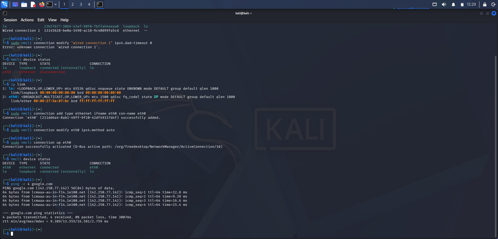

# Networkwalks-B082-Cybersecurity-lab-setup-week1
cybersecurity lab environment setup
#  Cybersecurity Lab Environment Setup

> **Building an isolated virtual lab for ethical hacking, penetration testing, and cybersecurity learning using Oracle VirtualBox and Kali Linux.**

---

##  Project Overview

This project documents the setup and configuration of a virtual cybersecurity laboratory using **Oracle VirtualBox** and **Kali Linux**.

The purpose of the lab is to create a safe and controlled environment where cybersecurity concepts and tools can be practiced, including:

* Kali Linux administration
* Network configuration
* Network reconnaissance
* Vulnerability assessment
* Network scanning
* Security tool testing
* Ethical hacking fundamentals

The lab can later be expanded by adding intentionally vulnerable target machines for authorized security testing.

---

##  Objectives

The main objectives of this project are to:

* Install and configure Oracle VirtualBox.
* Import Kali Linux as a virtual machine.
* Create a dedicated NAT Network.
* Configure Kali Linux networking.
* Verify IP addressing and routing.
* Test Internet and DNS connectivity.
* Create a clean VM snapshot.
* Document the complete lab setup.
* Prepare the environment for future cybersecurity projects.

---

##  Lab Architecture

The cybersecurity lab is built around a private NAT Network that connects Kali Linux with future target virtual machines.

```text
                         Internet
                            │
                            │
                    ┌───────▼────────┐
                    │    VirtualBox   │
                    └───────┬────────┘
                            │
                      NAT Network
                       10.0.0.0/24
                            │
                   ┌────────▼────────┐
                   │    Kali Linux   │
                   │   Attacker VM   │
                   │                 │
                   │   10.0.0.2/24   │
                   └────────┬────────┘
                            │
                   Future Target VMs
                 ┌──────────┴──────────┐
                 │                     │
           Metasploitable        Windows Test VM
```

### Lab Architecture Screenshot



---

##  Lab Configuration

| Component      | Configuration     |
| -------------- | ----------------- |
| Host OS        | Windows           |
| Hypervisor     | Oracle VirtualBox |
| Security OS    | Kali Linux        |
| Kali RAM       | 4096 MB           |
| Processors     | 2                 |
| Storage        | ~80 GB            |
| Network Type   | NAT Network       |
| Network        | `10.0.0.0/24`     |
| Kali Interface | `eth0`            |
| Gateway        | `10.0.0.1`        |

---

#  Lab Setup

## Step 1 — Install VirtualBox

Oracle VirtualBox was used as the virtualization platform for creating the cybersecurity laboratory.

It allows multiple operating systems to run as virtual machines on the same physical computer.

---

## Step 2 — Create the NAT Network

A dedicated **NAT Network** was created in VirtualBox.

### Configuration

```text
Network Name : NatNetwork
IPv4 Prefix  : 10.0.0.0/24
DHCP         : Enabled
IPv6         : Disabled
```

The NAT Network allows multiple virtual machines to communicate with each other while providing controlled external connectivity.

### NAT Network Configuration



---

## Step 3 — Import Kali Linux

The Kali Linux virtual machine was imported into VirtualBox.

### VM Configuration

```text
Operating System : Debian (64-bit)
RAM              : 4096 MB
Processors       : 2
Video Memory     : 128 MB
Storage          : ~80 GB
Network Adapter  : NAT Network
```

### Kali Linux VM


---

## Step 4 — Configure the Kali Linux Network Adapter

The Kali Linux VM network adapter was configured to use the NAT Network.

### Adapter Settings

```text
Adapter 1
Attached to : NAT Network
Network     : NatNetwork
```


## Step 5 — Configure Kali Linux Networking

The network configuration was checked from the Kali Linux terminal.

### Check Network Interface

```bash
ip addr
```

Example:

```text
eth0: <BROADCAST,MULTICAST,UP,LOWER_UP>
inet 10.0.0.2/24
```

### Check Routing Table

```bash
ip route
```

Example:

```text
default via 10.0.0.1 dev eth0
10.0.0.0/24 dev eth0
```

---

## Step 6 — Verify Connectivity

After configuring the network, connectivity was tested.

### Check Device Status

```bash
nmcli device status
```

### Activate the Ethernet Connection

```bash
sudo nmcli connection up eth0
```

### Test Internet Connectivity

```bash
ping -c 4 google.com
```

The test completed successfully with replies received and **0% packet loss**, confirming that the Kali Linux VM had working Internet connectivity.

---

#  Lab Verification

| Test             | Command               | Expected Result       |
| ---------------- | --------------------- | --------------------- |
| Check IP address | `ip addr`             | Kali IP displayed     |
| Check route      | `ip route`            | Default route present |
| Check device     | `nmcli device status` | `eth0` connected      |
| Test gateway     | `ping 10.0.0.1`       | Successful replies    |
| Test Internet    | `ping 8.8.8.8`        | Successful replies    |
| Test DNS         | `ping google.com`     | Domain resolves       |

---
##  Final Kali Linux Network Configuration

After configuring the Ethernet interface, the final network status was verified successfully.

### Network Connection Status

The `eth0` interface is now successfully connected:

```text
DEVICE   TYPE      STATE      CONNECTION
eth0     ethernet  connected  eth0
lo       loopback  connected  (externally) lo
```

### Internet Connectivity Test

The configuration was verified using:

```bash
ping -c 4 google.com
```

The test was successful:

```text
4 packets transmitted, 4 received, 0% packet loss
```

This confirms that the Kali Linux virtual machine has successfully established network connectivity.

###  Final Configuration Screenshot



#  Problems Encountered & Solutions

## Problem — Network Interface Disconnected

Initially, the `eth0` interface appeared disconnected.

### Troubleshooting Commands

```bash
ip addr
ip route
nmcli device status
```

A new NetworkManager connection was created and activated:

```bash
sudo nmcli connection add type ethernet ifname eth0 con-name eth0
sudo nmcli connection modify eth0 ipv4.method auto
sudo nmcli connection up eth0
```

After activating the connection, the interface became connected and Internet access was successfully verified.

---

#  What I Learned

Through this project, I learned:

### Virtualization

* Creating virtual machines with VirtualBox.
* Configuring VM resources.
* Managing snapshots.

### Networking

* IPv4 addressing.
* NAT Networks.
* Default gateways.
* DHCP.
* DNS.
* Routing tables.

### Kali Linux

* Managing network interfaces.
* Using NetworkManager.
* Troubleshooting connectivity.
* Verifying Internet access.

---

#  Skills Demonstrated

```text
Kali Linux
Oracle VirtualBox
Linux Administration
TCP/IP Networking
Network Troubleshooting
Nmap
Wireshark
Burp Suite
Cybersecurity Lab Design
Technical Documentation
Ethical Hacking Fundamentals
``

